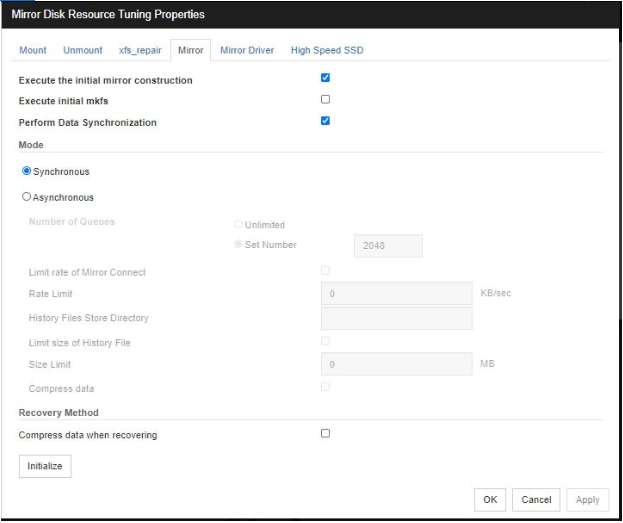

Zimbra with EXPRESSCLUSTER X on Linux
===

About this guide
---
This guide describes how to setup Zimbra with EXPRESSCLUSTER X. 
For the detailed information of EXPRESSCLUSTER X, please refer to [this site](https://www.nec.com/en/global/prod/expresscluster/index.html) .


Configurations description
---
In this document, create 2 nodes (Node1 and Node2 as below) mirror disk type cluster.
Prepare Zimbra HA/DR By using EXPRESSCLUSTER X. 


### Software versions
- Zimbra    (Release 8.8.12_GA_3794.RHEL7_64_20190329045002 RHEL7_64 FOSS edition, Patch 8.8.12_P1 proxy)
- CLUSTERPRO X 4.2 for Linux (internal version：4.2.0-200131-11)
- CLPX_BASE40_Linux_lcs1      (ECX license)
- CLPX_REPL40_Linux_lcs1      (ECX license)

### Cluster configurations
- Group resources
  - exec resource
  - floting IP resource
  - mirror disk resource
- Monitor rerources
  - floting IP resource
  - mirror disk connect monitor resource
  - mirror disk monitor resource
  - exec monitor resource

### Zimbra Prerequisites and Installation Procedure
---
System Requirements for Zimbra 
- Please refer and check to [this site](https://files.zimbra.com/website/docs/8.5/ZCS_System_Requirements_8.5.0.pdf) 

Please note that the following points are different if you will set Zimbra to EXPRESSCLUSTER.
- All zimbra configuration and database {/opt/zimbra} file will be present in the mirror disk.
- To completely disable Selinux on CentOS, open /etc/selinux/config file with a text editor and set the line SELINUX to disabled.
- Firewall should be in closed state. 


Zimbra Installation Procedure
---

1. Install Zimbra (New Installation) on the both servers.
    - Please do the Installation 
    - For the detailed information of Zimbra, please refer to [this site](https://wiki.zimbra.com/wiki/Zimbra_Releases/8.7.0/Single_Server_Installation)

     NOTE - 
     - If you are doing Zimbra fresh Installation make sure you should be install Zimbra on mirror disk partition.
     
     - After Zimbra Installation you need to take backup of zimbra files as below steps.
                	 
     - Firstly stop the zimbra service on server. 

            systemctl stop zimbra
     - Switch to root user and run the following command

            ps aux | grep zimbra

     - If any of the Zimbra processes are running then 
        use kill command to end the processes

     - Create a new directory in /mnt directory 
        say zimbra_backup.

            rsync -axvzKHS  --progress /opt/zimbra 
            /mnt/zimbra_backup
      

2. EXPRESSCLUSTER setup  
    - Let us consider the following 2 node cluster and try to understand it.

    ### Cluster Information
    ||Node1(Active)|Node2(Stanby)|
    |---|---|---|
    |Server Name|Server1|Server2|
    |IPaddress|10.0.7.166|10.0.7.167|  
    |cluster partition|/dev/sdb1|/dev/sdb1|
    |data partition|/dev/sdc2|/dev/sdc2|
    
    ### Failover Group Information  
    |Parameter|Value|
    |---|---|
    |Name|Failover1|
    |Startup Server| Server1 -> Server2 |
    |Floating ip address|10.0.7.170|
    |Mirror disk resource (mount point))|/opt/zimbra|
    
    - In Config mode of the Cluster WebUI, add failover group to use Zimbra.  
      You need to add the following resources.
      - Floating ip resource  
      - Mirror disk resource
    
     - If you want to know how to add resource, please refer to [this site](https://github.com/EXPRESSCLUSTER/BasicCluster/blob/master/X41/Lin/2nodesMirror_Lin.md#how-to-setup-basic-2-nodes-mirror-cluster-on-linux) 
     
     - After you add failver group and execute apply the configuration file, you start failover group by server1. 

    ### Note  
- Execute the initial mirror construction 

   - Specify if an initial mirror configuration is constructed when constructing a cluster

   - When the check box is selected:
      An initial mirror configuration will be constructed. 
 
   - The time that takes to construct the initial mirror is different from ext2/ext3/ext4 and other file systems. 

   - When the check box is not selected: 
     An initial mirror configuration will not be constructed.

<p align="center">

	
- Execute initial mkfs

  - Specify if an initial mkfs is constructed when constructing a cluster. This option can be set only if the initial mirror is being         constructed. 

  - In the case of hybrid disk resources, the clphdinit command behavior is executed instead of initial mkfs behavior upon cluster construction

  - When the check box is selected:
    An initial mkfs will be run

  - When the check box is not selected: 
    An initial mkfs will not be run.


     

3. Zimbra Setup 
   
   ### 3.1 Zimbra New Installation 
   
- Installing Zimbra on Primary Server

   - Start the failover group on the Primary server.
 
    - Download “Zimbra collaboration suite” package. Open the web browser and go to the following URL. Choose Zimbra version.
     [this site](http://www.zimbra.com/downloads/)
    Copy the package to the /tmp directory.

  - Extract the installation files from the .tar file. Right click and click on Extract here.
  - Open terminal and change the directory to the extracted   folder.

            root@mail-1 ~> cd /tmp/zcs-8.X.XXXXXXXXXXX

  - Run the install.sh file from the zimbra extracted folder
  
            ./install.sh

  - Press Y and Enter to accept the terms of the license agreement
  - As this package is for RHEL so there will be a warning message. Press Y and Enter to continue.
  - Press Enter on all the packages with their default install options
  - Press Y and Enter to continue with installation.
  - Press Y and Enter on the "The system will be modified"     prompt to begin the installation of the zimbra packages.
  - In the configuration main menu choose option 3-> then choose  option 4 and set the admin password for zimbra mail server.
  - Press "r" top return to the main menu
  - Press "a" and Enter to apply the configuration
  - Press Enter to save the configuration file.
  - Press Enter to accept the default path for the configuration data or provide a custom path.
  - Press Y and enter to continue the system modification
  - Press N and Enter to cancel the notification of Zimbra installation
  - Press Enter to complete the configuration.


   
   ### 3.2 Modifying the hosts file of both the servers. 

    - Open the terminal on the desktop and run the following command: 

            vi /etc/hosts

      - Create an entry for the IP address, Fully Qualified Domain Name of the Primary server. 

      - Save the hosts file and exit. 

      - Verify the DNS server IP and DNS search path in the NIC card settings run the following command: 

            nmtui


    ### 3.3 Zimbra Existing Installation:
  
  - "In this case when Zimbra is installed in another disk and  want to move data to the mirror partition".

  # Existing Installation 

NOTE :-
     - The backup file must be available before performing this activity. 


 - Moving the existing Zimbra installation to the data partition (if Zimbra is already installed) 

   - Access the Web Manager of EXPRESSCLUSTER X from client machine. Expand the Failover group and right click on the mirror disk resource and click on Stop. 
   - Open the terminal on server where Zimbra was already installed. 
   - Switch to root user and run the following command: 

              ps aux | grep zimbra 

   - Make sure that all the Zimbra processes are stopped. If any of the Zimbra processes are running then use kill command to end the same. 


- Run the following command to copy the existing Zimbra files to this location: 

      rsync -axvzKHS --progress /mnt/zimbra_backup  /opt/zimbra  

 - Once the copy has been successfully done, go to the cluster manager from Machine 3 and start the MD resource i.e. Right click on mirror disk and click on Start 

 - Run the bellow command to fix permission for all the files:--
   /opt/zimbra/libexec/zmfixperms  -e  -v

 - After the copy is successful, start the Zimbra services by running the following command to verify that the copy has been done successfully: 

 - Service zimbra start 

 - after moving the data from default partition to data partition perform the steps mention in section 6.4 on primary server. 


### Modify the Hosts file on both server 

 - Stop the Zimbra service
 - Bind the hostname with FIP in the hosts file.
 - Save the hosts file & exit. 
 - Start the Zimbra service & verify the Zimbra.


   
  - Install and configure Zimbra mail server on secondary server (ensure Zimbra service is in stop state on primary server) 
   by following the procedure from Section 6.2{xx} to Section 6.4{xx}. After the zimbra installation is complete, stop the zimbra service & rename the zimbra directory on secondary server & move the failover group from secondary to primary server.

          example :-
         /opt/zimbra    {after installation on secondary}
         /opt/zimbraold {New name of the directory on secondary}

     


### Setup Zimbra Server cluster
#### On Primary Server
1. Add one exec resource to the failover group
	- failover group
		- exec
			- start.sh: Refer a [sample script](https://github.com/Anshuman-J/Zimbra-/blob/main/EXPRESSCLUSTER%20X%20for%20Zimbra.md#sample-scripts)
			- stop.sh:  Refer a [sample script](https://github.com/Anshuman-J/Zimbra-/blob/main/EXPRESSCLUSTER%20X%20for%20Zimbra.md#sample-scripts)
1. Apply the configuration
1. Start the exec resource


## Sample scripts
### start.sh
```bat
#! /bin/sh
#***************************************
#*              start.sh               *
#***************************************

#ulimit -s unlimited

systemctl start zimbra

exit $?
```
### stop.sh
```bat
#! /bin/sh
#***************************************
#*              start.sh               *
#***************************************

#ulimit -s unlimited

systemctl stop zimbra

exit $?
```


    


    -
